# 🌩️ Internal Azure administrative tiering

Create **internal** tier models for Azure, Entra and Microsoft Graph administrative assets, **based on known attack paths**.

## 📌 Overview

| Available tier models |
|---|
| ☁️ [Azure roles tiering](Azure%20roles) |
| 👤 [Entra roles tiering](Entra%20roles) |
| 🤖 [MS Graph application permissions tiering](Microsoft%20Graph%20application%20permissions) |

## 🎯 Objective

The public [Azure administrative tiering](https://github.com/emiliensocchi/azure-tiering) project provides tier models based on attack paths for the following **built-in** administrative assets:
- Common Azure roles
- All Entra roles
- All MS Graph application permissions

The objective of this project is to provide a way to **extend** the [Azure administrative tiering](https://github.com/emiliensocchi/azure-tiering) initiative (referred to as the "upstream project") to build **internal** company-specific tier models answering different requirements, but based on the same philosophy.

## ✨ Features

Once configured with an Entra tenant, this project allows categorizing **tenant-specific assets** in an easy manner, to provide integrated tools a complete picture of those assets.

The project monitors the following content:

- 🏷️ **Tiered** assets from the upstream [Azure administrative tiering](https://github.com/emiliensocchi/azure-tiering) (AAT) project, which includes:
    - **Common** <u>built-in</u> Azure roles
    - **All** <u>built-in</u> Entra roles
    - **All** <u>built-in</u> MS Graph application permissions
- 📛 **Untiered** assets from the configured Entra tenant, including:
    - **All** <u>custom</u> Azure roles
    - **All** <u>custom</u> Entra roles
    - **In-use** <u>built-in</u> Azure roles
        - Roles currently assigned, but not tiered [upstream](https://github.com/emiliensocchi/azure-tiering)

## 🔀 Worfklow

Once configured with an Entra tenant, this project triggers the following workflow **daily** at **01:00 am UTC**:

```mermaid
flowchart TD
    A[📦 Internal AAT repository] -->|Get from upstream| B{**Tiered** assets}

    B --> C[**Common Built-in** <br> ☁️ Azure roles]
    B --> D[**All Built-in** <br> 👤 Entra roles]
    B --> E[**All Built-in** <br> 🤖 MS Graph application permissions]

    C -->|Merge to| F[📦 Internal AAT repository]
    D -->|Merge to| F[📦 Internal AAT repository]
    E -->|Merge to| F[📦 Internal AAT repository]

    F[📦 Internal AAT repository] -->|Get from configured <br>Entra tenant| G{**Untiered** assets}

    G --> H[**All Custom** <br> ☁️ Azure roles]
    G --> I[**All Custom** <br> 👤 Entra roles]
    G --> J["**In-use Built-in** <br> ☁️ Azure roles <br>(assigned in the configured tenant, but not tiered upstream)"]

    H -->|Merge to| K[📂 Azure roles / <br>📄 Untiered Azure roles.md]
    I -->|Merge to| L[📂 Entra roles / <br>📄 Untiered Entra roles.md]
    J -->|Merge to| K[📂 Azure roles / <br>📄 Untiered Azure roles.md]

    K-->|Located in| M[📦 Internal AAT repository]
    L-->|Located in| M[📦 Internal AAT repository]

    M -->|Reviewed for categorizing based on known attack paths by| N[👤 Internal AAT project owner]
```

### 📃 High-level workflow description

1. Retrieve the latest changes from upstream (i.e the [Azure administrative tiering](https://github.com/emiliensocchi/azure-tiering) (AAT) project), and merge locally with this repository.

2. From the Entra tenant configured with this project, retrieve untiered assets and add them to the untiered sections of this repository (see [Untiered Azure roles](Azure%20roles/Untiered%20Azure%20roles.md) and [Untiered custom Entra roles](Entra%20roles/Untiered%20custom%20Entra%20roles.md)).

3. The owner of this repository reviews untiered assets and categorizes them based on known attack paths.

Note: the preservation of local changes in step 1 depends on the value set for the `keepLocalChanges` parameter in the [configuration file](config.json) of this project (see [Installation](#-installation) for more information).

## 🛠️ Integration

> [!IMPORTANT]  
> Changes made to the Markdown version of a tier model are reflected automatically to its JSON version when pushed to this repository and vice versa.

Each tier model is available in table format for human readability, as well as JSON format for machine consumption:

| Human-readable | Machine-consumable |
|---|---|
| [Azure roles tiering](Azure%20roles/README.md) | [`tiered-azure-roles.json`](Azure%20roles/tiered-azure-roles.json) |
| [Entra roles tiering](Entra%20roles) | [`tiered-entra-roles.json`](Entra%20roles/tiered-entra-roles.json) |
| [MS Graph application permissions tiering](Microsoft%20Graph%20application%20permissions/README.md) | [`tiered-msgraph-app-permissions.json`](Microsoft%20Graph%20application%20permissions/tiered-msgraph-app-permissions.json) |

By integrating this project with multiple tools, organizations can easily ensure that the same tiers are used across their entire technology stack, while centralizing tier definitions into a single place.

## 🔌 Installation

This project can be configured with an Entra tenant as follows:

### ⚙️ Configure the project

1. Fork this project.

2. In [`config.json`](config.json), set the value of `keepLocalChanges` to decide whether local changes are preserved when pulling latest changes from [upstream](https://github.com/emiliensocchi/azure-tiering) (see [step 1](#-high-level-workflow-description)):

    | Value | Behavior | Use case |
    |---|---|---|
    | `false` | Any change applied to built-in assets locally is overwritten on the next run.  This is the **default behavior**. | No desire to tier differently from upstream. This solution offers the easiest maintainability. | 
    | `true` | Changes applied locally to built-in assets are preserved on each run. If assets are added or removed upstream due to Microsoft changes in the platform, those are merged locally on the next run, without impacting changes made on local assets. |  Have the ability to tier differently from upstream, while keeping updates when new built-in assets are added or removed by Microsoft. | 

### 🔓 Provide access to an Entra tenant

1. In the Entra tenant to be monitored, create a service principal with a new [Federated credential](https://learn.microsoft.com/en-us/entra/workload-id/workload-identity-federation-create-trust?pivots=identity-wif-apps-methods-azp#github-actions), and take note of the following:
    1. The **tenant ID** associated with the service principal
    2. The service principal's **application/client ID**

2. In the forked GitHub project, create the following repository variables:
    | Name | Value | 
    |---|---|
    | `AZURE_TENANT_ID` | \<value-from-step-1-i\> |
    | `AZURE_CLIENT_ID` | \<value-from-step-1-ii\> | 

3. Grant the following MS Graph application permissions to the service principal:
    | Application permission | Justification | 
    |---|---|
    | [`Application.Read.All`](https://learn.microsoft.com/en-us/graph/permissions-reference#applicationreadall) | Required to read the definitions of application permissions. |
    | [`RoleManagement.Read.Directory`](https://learn.microsoft.com/en-us/graph/permissions-reference#rolemanagementreaddirectory) | Required to read Entra role definitions. | 

4. Create a [custom Azure role](https://learn.microsoft.com/en-us/azure/role-based-access-control/custom-roles-portal#start-from-scratch) as follows:

    | Custom role name | Description | 
    |---|---|
    | Role assignment reader | Read Azure scopes, role assignments and definitions. Provides no access to the control or data plane of Azure resources. |

    | Action permission | Justification | 
    |---|---|
    | `Microsoft.Authorization/roleAssignments/read` | Required to read active, eligible and permanent Azure role assignments. | 
    | `Microsoft.Authorization/roleDefinitions/read` | Required to read Azure role definitions. | 
    | `Microsoft.Management/managementGroups/read` | Required to list Management Groups. | 
    | `Microsoft.Resources/subscriptions/read` | Required to list subscriptions. | 
    | `Microsoft.Resources/subscriptions/resourceGroups/read` | Required to list resource groups. | 
    | `Microsoft.Resources/subscriptions/resourceGroups/resources/read` | Required to list Azure resources.  | 

   See the [Microsoft.Authorization](https://learn.microsoft.com/en-us/azure/role-based-access-control/permissions/management-and-governance#microsoftauthorization), [Microsoft.Management](https://learn.microsoft.com/en-us/azure/role-based-access-control/permissions/management-and-governance#microsoftmanagement) and [Microsoft.Resources](https://learn.microsoft.com/en-us/azure/role-based-access-control/permissions/management-and-governance#microsoftresources) resource providers for more information about the above role actions. 

    **Important**: the role actions are required to identify built-in Azure roles that are in use in the environment and filter out other roles. This is part of step 2 in the described [workflow](#-high-level-workflow-description), where the project retrieves built-in Azures roles that are assigned in the configured tenant, but untiered upstream.

5. Assign the `Role assignment reader` role to the service principal created in step 1, and scope it to the Tenant Root Management group. This allows to read role assignments at all scopes (e.g. subscriptions, resources groups, etc.) without the ability to read the content of Azure resources.

## ▶️ First run

Once this project has been forked and configured with an Entra tenant using the [installation](#-installation) guide, run the following GitHub workflows manually to populate the tier models:

1. Workflow: "Sync from upstream"

    

2. Workflow: "Convert JSON to Markdown"

    

3. Workflow: "Detect untiered assets"

    

At this point, the following should be in place:

1. All tier models are populated with built-in assets retrieved from [upstream](https://github.com/emiliensocchi/azure-tiering).

2. The untiered section of each model (see [Untiered Azure roles](Azure%20roles/Untiered%20Azure%20roles.md) and [Untiered custom Entra roles](Entra%20roles/Untiered%20custom%20Entra%20roles.md)) is populated with assets specific to the configured tenant. 

## 📢 Disclaimer

This project is based on the [Azure administrative tiering](https://github.com/emiliensocchi/azure-tiering) research project. See its own [disclaimer](https://github.com/emiliensocchi/azure-tiering?tab=readme-ov-file#-disclaimer) for more information.
